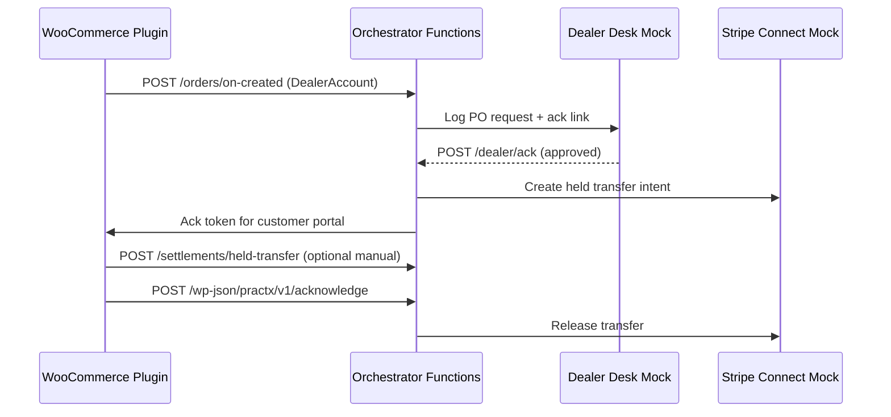
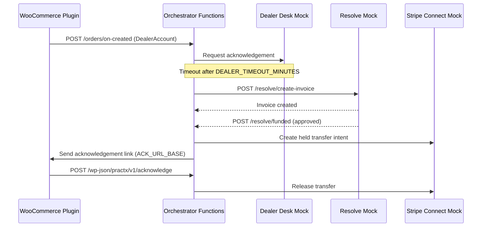

# Payment & settlement sequence diagrams

## Dealer-approved happy path

```mermaid
sequenceDiagram
    participant Woo as WooCommerce Plugin
    participant Func as Orchestrator Functions
    participant Dealer as Dealer Desk Mock
    participant Stripe as Stripe Connect Mock

    Woo->>Func: POST /orders/on-created (DealerAccount)
    Func->>Dealer: Log PO request + ack link
    Dealer-->>Func: POST /dealer/ack (approved)
    Func->>Stripe: Create held transfer intent
    Func->>Woo: Ack token for customer portal
    Woo->>Func: POST /settlements/held-transfer (optional manual)
    Woo->>Func: POST /wp-json/practx/v1/acknowledge
    Func->>Stripe: Release transfer
```

## Resolve fallback with customer acknowledgement

```mermaid
sequenceDiagram
    participant Woo as WooCommerce Plugin
    participant Func as Orchestrator Functions
    participant Dealer as Dealer Desk Mock
    participant Resolve as Resolve Mock
    participant Stripe as Stripe Connect Mock

    Woo->>Func: POST /orders/on-created (DealerAccount)
    Func->>Dealer: Request acknowledgement
    Note over Func,Dealer: Timeout after DEALER_TIMEOUT_MINUTES
    Func->>Resolve: POST /resolve/create-invoice
    Resolve-->>Func: Invoice created
    Resolve-->>Func: POST /resolve/funded (approved)
    Func->>Stripe: Create held transfer intent
    Func->>Woo: Send acknowledgement link (ACK_URL_BASE)
    Woo->>Func: POST /wp-json/practx/v1/acknowledge
    Func->>Stripe: Release transfer
```
